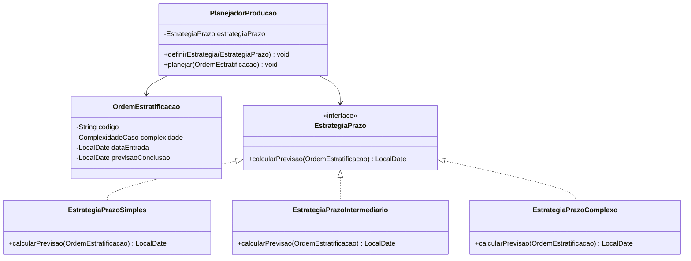

# Fluxo de Estratificação Cerâmica

Projeto autoral de estudo desenvolvido para o desafio **Design Patterns com Java: Dos Clássicos (GoF) ao Spring Framework**, da [DIO](https://www.dio.me/).

> Esta é uma **criação autoral focada em um padrão**, conforme uma das abordagens permitidas no desafio.

## Objetivo

Consolidar o padrão de projeto **Strategy** em Java puro por meio de um planejador didático de prazos para ordens de estratificação cerâmica.

O programa calcula uma previsão fictícia de conclusão a partir da complexidade da ordem, mantendo cada regra de prazo em uma classe própria.

> **Aviso importante:** os códigos, as datas e os prazos deste repositório são fictícios. O projeto não utiliza dados de pacientes nem informações clínicas e não deve ser usado para planejamento real de produção.

## O problema

Sem o padrão Strategy, uma única classe de planejamento tenderia a acumular condicionais como `if/else` para cada complexidade de caso. A cada nova regra, seria necessário alterar essa mesma classe.

Com Strategy, o `PlanejadorProducao` recebe uma regra por meio da interface `EstrategiaPrazo`. Assim, ele aplica a estratégia atual sem saber se ela representa um caso simples, intermediário ou complexo.

## Regras fictícias

| Complexidade | Estratégia | Prazo didático |
| --- | --- | --- |
| `SIMPLES` | `EstrategiaPrazoSimples` | +3 dias corridos |
| `INTERMEDIARIO` | `EstrategiaPrazoIntermediario` | +5 dias corridos |
| `COMPLEXO` | `EstrategiaPrazoComplexo` | +8 dias corridos |

## Estrutura e Strategy



## Como executar

### Pré-requisito

- JDK 21 ou superior instalado.

No PowerShell, a partir da raiz do repositório:

```powershell
New-Item -ItemType Directory -Path out -Force
javac --release 21 -d out (Get-ChildItem -Recurse -Filter *.java | Select-Object -ExpandProperty FullName)
java -cp out br.com.fluxoestratificacao.Main
```

## Saída esperada

```text
Código: ORD-001 | Complexidade: SIMPLES | Previsão: 2026-09-20
Código: ORD-002 | Complexidade: INTERMEDIARIO | Previsão: 2026-09-22
Código: ORD-003 | Complexidade: COMPLEXO | Previsão: 2026-09-25
```

## O que aprendi

- Um `enum` restringe a complexidade a valores previamente definidos.
- Uma interface define o contrato compartilhado por regras diferentes.
- Cada implementação de `EstrategiaPrazo` concentra uma única regra de cálculo.
- O `PlanejadorProducao` troca estratégias em tempo de execução com `definirEstrategia`.
- Uma nova estratégia pode ser adicionada implementando a interface, sem modificar as estratégias existentes.

## Fora do escopo desta versão

- Spring Framework e API REST;
- banco de dados;
- Singleton e Facade;
- dados reais de pacientes ou informações clínicas.

## Referências

- [DIO — Padrões de Projeto com Java Puro](https://github.com/digitalinnovationone/lab-padroes-projeto-java)
- [DIO — Padrões de Projeto com Spring](https://github.com/digitalinnovationone/lab-padroes-projeto-spring)

## Short summary in English

An author-created Java learning project focused on the Strategy design pattern. It calculates fictional production deadlines for ceramic layering orders, using interchangeable strategies for simple, intermediate, and complex cases. No patient or clinical data is used.
